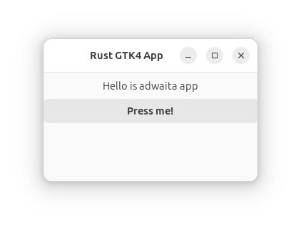

# Adwaita Rust Skeleton

This is a simple Rust project using Adwaita for creating a graphical user interface (GUI) application. It serves as a starting point for those exploring GTK4 and Adwaita in Rust. Please note, this is not a professional project but rather a personal exploration of how to create applications with Rust, GTK4, and Adwaita.



## License

This project is licensed under the MIT License.

## How to Run

Clone the repository.
Run 
```bash
cargo build.
```
Execute the project using cargo run.